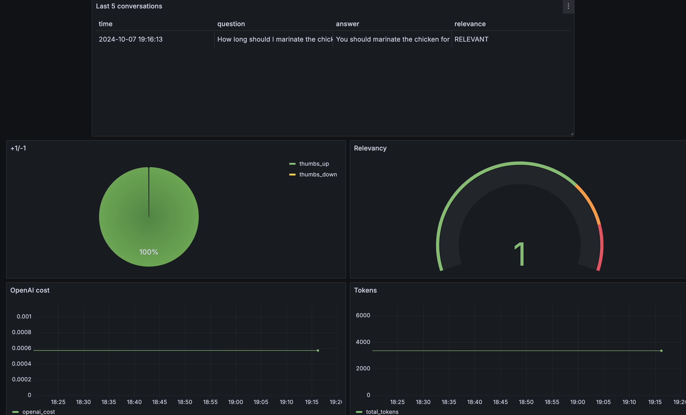

# Diet Plan Assistant

<p align="center">
  
</p>

# About the project

The AI Diet Plan Assistant is an intelligent tool that helps you create personalized meal plans and find healthy recipes. Powered by a large language model (LLM), it offers tailored nutrition advice, suggests recipes based on your preferences, and provides detailed insights into ingredients. Whether you're looking to achieve specific health goals or simply eat better, this assistant makes healthy eating easy and enjoyable.

## Problem statement

Maintaining a healthy and balanced diet can be challenging due to the overwhelming amount of information, varying dietary needs, and busy lifestyles. Many individuals struggle to find nutritious recipes that suit their preferences, dietary restrictions, and health goals. Existing solutions often lack personalization, making it difficult for users to receive meal recommendations that align with their specific needs. There is a need for an intelligent, user-friendly system that provides personalized meal plans, nutrition guidance, and recipe suggestions in a way that is both accessible and easy to follow.

The AI Diet Plan Assistant aims to solve this problem by using advanced AI and natural language processing to deliver customized dietary solutions that help users meet their nutritional goals efficiently.

## Data source

Original dataset used in this project is the [Food.com - Recipes and Reviews](https://www.kaggle.com/datasets/irkaal/foodcom-recipes-and-reviews/data). 
The dataset was generated using ChatGPT and contains 170 records. 
You can find the data in [`data/recipes.csv`](data/recipes.csv).

## Technologies

- Python 3.12
- Docker and Docker Compose for containerization
- [Minsearch](https://github.com/alexeygrigorev/minsearch) for full-text search
- Flask as the API interface (see [Background](#background) for more information on Flask)
- Grafana for monitoring and PostgreSQL as the backend for it
- OpenAI as an LLM


## Preparation

Since we use OpenAI, you need to provide the API key.
1. Follow [setup](https://direnv.net/docs/hook.html) to install `direnv`.
2. Copy `.envrc_template` into `.envrc` and insert your key there.
3. For OpenAI, it's recommended to create a new project and use a separate key.
4. Run `direnv allow` to load the key into your environment.

For dependency management, we use `conda`, so you need to install it:
```bash
brew install miniconda
```
create env:
```bash
conda create --platform osx-64 --name llm-zoomcamp-project python=3.12
```
activate env:
```bash
conda activate llm-zoomcamp-project
```
install the app dependencies:
```bash
conda install --yes --file requirements.txt
```
```bash
conda install --yes --file requirements.dev.txt
```

### Database configuration

Before the application starts for the first time, the database
needs to be initialized.

First, run `postgres`:

```bash
docker-compose up postgres
```

Then run the [`db_prep.py`](app/db_prep.py) script:

```bash
cd app

export POSTGRES_HOST=localhost
python db_prep.py
```

To check the content of the database, use `pgcli` (already
installed with conda):

```bash
pgcli -h localhost -U your_username -d course_assistant -W
```

You can view the schema using the `\d` command:

```sql
\d conversations;
```

And select from this table:

```sql
select * from conversations;
```

### Running with Docker-Compose

The easiest way to run the application is with `docker-compose`:

```bash
docker-compose up
```
## Using the application

When the application is running, we can start using it.

### CLI

We built an interactive CLI application using
[questionary](https://questionary.readthedocs.io/en/stable/).

To start it, run:

```bash
python cli.py
```

You can also make it randomly select a question from
[our ground truth dataset](data/ground-truth-retrieval.csv):

```bash
python cli.py --random
```

### Using `requests`

When the application is running, you can use
[requests](https://requests.readthedocs.io/en/latest/)
to send questions—use [test.py](test.py) for testing it:

```bash
python test.py
```

It will pick a random question from the ground truth dataset
and send it to the app.

### CURL

You can also use `curl` for interacting with the API:

```bash
URL=http://localhost:8000
QUESTION="How long should I marinate the chicken for the best flavor?"
DATA='{
    "question": "'${QUESTION}'"
}'

curl -X POST \
    -H "Content-Type: application/json" \
    -d "${DATA}" \
    ${URL}/question
```

You will see something like the following in the response:

```json
{
    "answer":"You should marinate the chicken for 4 to 24 hours in the refrigerator for the best flavor.","conversation_id":"0d73164c-abcf-4622-a6c2-5e163010fdcd","question":"How long should I marinate the chicken for the best flavor?"
}
```

Sending feedback:

```bash
ID="0d73164c-abcf-4622-a6c2-5e163010fdcd"
URL=http://localhost:8000
FEEDBACK_DATA='{
    "conversation_id": "'${ID}'",
    "feedback": 1
}'

curl -X POST \
    -H "Content-Type: application/json" \
    -d "${FEEDBACK_DATA}" \
    ${URL}/feedback
```

After sending it, you'll receive the acknowledgement:

```json
{
    "message":"Feedback received for conversation 0d73164c-abcf-4622-a6c2-5e163010fdcd: 1"
}
```

## Code

The code for the application is in the [`app`](app/) folder:

- [`app.py`](app/app.py) - the Flask API, the main entrypoint to the application
- [`rag.py`](app/rag.py) - the main RAG logic for building the retrieving the data and building the prompt
- [`ingest.py`](app/ingest.py) - loading the data into the knowledge base
- [`minsearch.py`](app/minsearch.py) - an in-memory search engine
- [`db.py`](app/db.py) - the logic for logging the requests and responses to postgres
- [`db_prep.py`](app/db_prep.py) - the script for initializing the database

We also have some code in the project root directory:

- [`test.py`](test.py) - select a random question for testing
- [`cli.py`](cli.py) - interactive CLI for the APP

### Interface

We use Flask for serving the application as an API.

Refer to the ["Using the Application" section](#using-the-application)
for examples on how to interact with the application.

### Ingestion

The ingestion script is in [`ingest.py`](app/ingest.py).

Since we use an in-memory database, `minsearch`, as our
knowledge base, we run the ingestion script at the startup
of the application.

It's executed inside [`rag.py`](app/rag.py)
when we import it.

## Experiments

For experiments, we use Jupyter notebooks.
They are in the [`notebooks`](notebooks/) folder.

- [`rag-test.ipynb`](notebooks/rag-test.ipynb): The RAG flow and evaluating the system.
- [`evaluation-data-generation.ipynb`](notebooks/evaluation-data-generation.ipynb): Generating the ground truth dataset for retrieval evaluation.

### Retrieval evaluation

The basic approach - using `minsearch` without any boosting - gave the following metrics:

- Hit rate: 82%
- MRR: 69%

The improved version (with tuned boosting):

- Hit rate: 85%
- MRR: 70%

The best boosting parameters:

```python
 boost = {
        'Name': 1.94,
        'Description': 0.57,
        'RecipeInstructions': 2.26,
        'Calories': 1.41,
        'FatContent': 1.21,
        'SaturatedFatContent': 0.67,
        'CholesterolContent': 0.76,
        'SodiumContent': 1.40,
        'CarbohydrateContent': 2.53,
        'FiberContent': 2.42,
        'SugarContent': 0.28,
        'ProteinContent': 0.03
    }
```

### RAG flow evaluation

We used the LLM-as-a-Judge metric to evaluate the quality
of our RAG flow.

For `gpt-4o-mini`,  we had:

- 83% `RELEVANT`
- 15% `PARTLY_RELEVANT`
- 1.5% `NON_RELEVANT`

We also tested `gpt-4o`:

- 86% `RELEVANT`
- 9% `PARTLY_RELEVANT`
- 4.5% `NON_RELEVANT`

The difference is not huge, so we decided to use `gpt-4o-mini`.

### Setting up Grafana

All Grafana configurations are in the [`grafana`](grafana/) folder:

- [`init.py`](grafana/init.py) - for initializing the datasource and the dashboard.
- [`dashboard.json`](grafana/dashboard.json) - the actual dashboard (taken from LLM Zoomcamp without changes).

To initialize the dashboard, first ensure Grafana is
running (it starts automatically when you do `docker-compose up`).

Then run:

```bash
cd grafana

# make sure the POSTGRES_HOST variable is not overwritten 
env | grep POSTGRES_HOST

python init.py
```

Then go to [localhost:3000](http://localhost:3000):

- Login: "admin"
- Password: "admin"

When prompted, keep "admin" as the new password.

## Monitoring

We use Grafana for monitoring the application. 

It's accessible at [localhost:3000](http://localhost:3000):

- Login: "admin"
- Password: "admin"

### Dashboards

<p align="center">
  
</p>

The monitoring dashboard contains several panels:

1. **Last 5 Conversations (Table):** Displays a table showing the five most recent conversations, including details such as the question, answer, relevance, and timestamp. This panel helps monitor recent interactions with users.
2. **+1/-1 (Pie Chart):** A pie chart that visualizes the feedback from users, showing the count of positive (thumbs up) and negative (thumbs down) feedback received. This panel helps track user satisfaction.
3. **Relevancy (Gauge):** A gauge chart representing the relevance of the responses provided during conversations. The chart categorizes relevance and indicates thresholds using different colors to highlight varying levels of response quality.
4. **OpenAI Cost (Time Series):** A time series line chart depicting the cost associated with OpenAI usage over time. This panel helps monitor and analyze the expenditure linked to the AI model's usage.
5. **Tokens (Time Series):** Another time series chart that tracks the number of tokens used in conversations over time. This helps to understand the usage patterns and the volume of data processed.
6. **Model Used (Bar Chart):** A bar chart displaying the count of conversations based on the different models used. This panel provides insights into which AI models are most frequently used.
7. **Response Time (Time Series):** A time series chart showing the response time of conversations over time. This panel is useful for identifying performance issues and ensuring the system's responsiveness.
